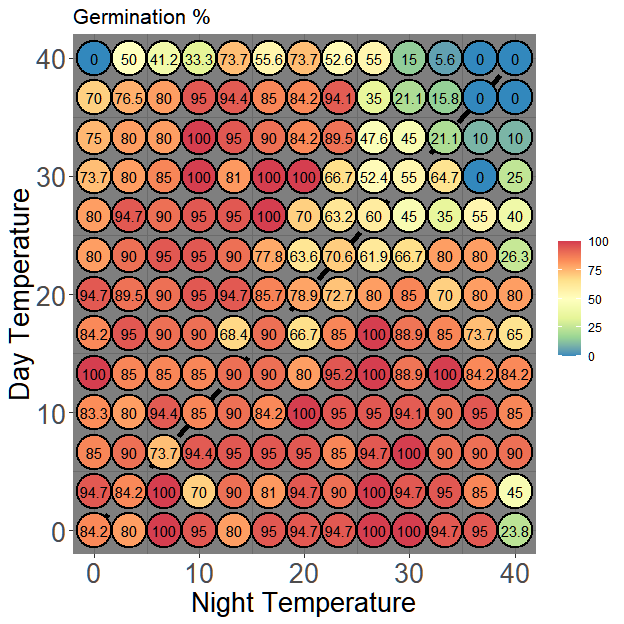

<!-- README.md is generated from README.Rmd. Please edit that file -->

# thermgRad

<!-- badges: start -->

[](https://github.com/pgomba/thermgRad/actions)

<!-- badges: end -->

## Tools to visualize and analyze germination in temperature gradient plates


`thermgRad` package aims to provide with tools to visualize and analyze
germination experiments conducted using a temperature gradient plate
(TGP) with a bidirectional setting (day/night cycle) and obtain cardinal
temperatures for each of the temperature fluctuations thresholds across
the thermal gradient plate.

## Installation

You can install the development version of thermgRad from
[GitHub](https://github.com/) with:

``` r
#install.packages("devtools")
#devtools::install_github("pgomba/thermgRad") 
library(thermgRad)
```

## What data does the package require?

Temperature: `thermgRad` needs average day and night corner
temperatures. These are better recorded with an external temperature
logger, since temperatures on the top side of the plate differ from
those used in the TGP settings. If possible, I think is better to record
corner temperatures in the center of each corner Petri dish (either log
the temperature before or after the experiment). But `thermgRad`
provides the necessary tools to transform corner temperatures to corner
Petri dish center temperatures (which depends on Petri dish cover
radio).
<center>

</center>

Germination: `thermgRad` requires, for each Petri dish:

-   Petri dish ID

-   Cumulative germination

-   Total number of seeds in the Petri dish (germinated + moldy + viable
    after cut test)

-   Day for each germination record

The data frame format containing all this information is a bit
restrictive, but an example to how it should be formatted prior to load
the data frame can be seen running the following code:

``` r
View(thermgRad::tg_example)
```

## Functions

### How is T<sub>50</sub> calculated?

T<sub>50</sub> values are obtained via `thermgRad::coolbear`, a function
adapting Coolbear et al. (1984) formula modified by Farooq et al.(2005).
<center>

</center>

where N represents the number of sowed seeds (germinated + viable +
moldy) from a single replicate in all the experiments and n<sub>i</sub>
and n<sub>j</sub> are the number of seeds germinated adjacently to (N/2)
at time t<sub>i</sub> and t<sub>j</sub> respectively. An example:

``` r
scoring_days<-c(seq(1,20,2))
cumulative_germination<-c(0,0,0,6,7,12,18,23,23,23)
total_seeds<-25

thermgRad::coolbear(scoring_days,cumulative_germination,total_seeds) #Outputs T50
#> [1] 11.16667
```

Among other things, `thermgRad::petri_grid` loops `thermgRad::coolbear`
all over the template data frame to obtain T<sub>50</sub> values for
each Petri dish

### Visualizing your experiment

`thermgRad::plot_results` collects your experiments results and
temperatures and collects them on a Day/Night graph. It´s possible to
choose between showing average Petri dish temperature, average
temperature fluctuation and germination with parameter
`toplot= "average`,`toplot= "fluctuation`or`toplot= "germina"`.

``` r
data<-thermgRad::tg_example
plot_results(data, 0,0,40,40,0,40,0,40, petri=13, toplot= "germina")
#>     PD_ID  day_temp night_temp   average   fluc abs_fluc       germ
#> 1      A1 40.000000   0.000000 20.000000  40.00    40.00   0.000000
#> 2      A2 36.666667   0.000000 18.333333  36.67    36.67  70.000000
#> 3      A3 33.333333   0.000000 16.666667  33.33    33.33  75.000000
#> 4      A4 30.000000   0.000000 15.000000  30.00    30.00  73.684211
#> 5      A5 26.666667   0.000000 13.333333  26.67    26.67  80.000000
#> 6      A6 23.333333   0.000000 11.666667  23.33    23.33  80.000000
#> 7      A7 20.000000   0.000000 10.000000  20.00    20.00  94.736842
#> 8      A8 16.666667   0.000000  8.333333  16.67    16.67  84.210526
#> 9      A9 13.333333   0.000000  6.666667  13.33    13.33 100.000000
#> 10    A10 10.000000   0.000000  5.000000  10.00    10.00  83.333333
#> 11    A11  6.666667   0.000000  3.333333   6.67     6.67  85.000000
#> 12    A12  3.333333   0.000000  1.666667   3.33     3.33  94.736842
#> 13    A13  0.000000   0.000000  0.000000   0.00     0.00  84.210526
#> 14     B1 40.000000   3.333333 21.666667  36.67    36.67  50.000000
#> 15     B2 36.666667   3.333333 20.000000  33.33    33.33  76.470588
#> 16     B3 33.333333   3.333333 18.333333  30.00    30.00  80.000000
#> 17     B4 30.000000   3.333333 16.666667  26.67    26.67  80.000000
#> 18     B5 26.666667   3.333333 15.000000  23.33    23.33  94.736842
#> 19     B6 23.333333   3.333333 13.333333  20.00    20.00  90.000000
#> 20     B7 20.000000   3.333333 11.666667  16.67    16.67  89.473684
#> 21     B8 16.666667   3.333333 10.000000  13.33    13.33  95.000000
#> 22     B9 13.333333   3.333333  8.333333  10.00    10.00  85.000000
#> 23    B10 10.000000   3.333333  6.666667   6.67     6.67  80.000000
#> 24    B11  6.666667   3.333333  5.000000   3.33     3.33  90.000000
#> 25    B12  3.333333   3.333333  3.333333   0.00     0.00  84.210526
#> 26    B13  0.000000   3.333333  1.666667  -3.33     3.33  80.000000
#> 27     C1 40.000000   6.666667 23.333333  33.33    33.33  41.176471
#> 28     C2 36.666667   6.666667 21.666667  30.00    30.00  80.000000
#> 29     C3 33.333333   6.666667 20.000000  26.67    26.67  80.000000
#> 30     C4 30.000000   6.666667 18.333333  23.33    23.33  85.000000
#> 31     C5 26.666667   6.666667 16.666667  20.00    20.00  90.000000
#> 32     C6 23.333333   6.666667 15.000000  16.67    16.67  95.000000
#> 33     C7 20.000000   6.666667 13.333333  13.33    13.33  90.000000
#> 34     C8 16.666667   6.666667 11.666667  10.00    10.00  90.000000
#> 35     C9 13.333333   6.666667 10.000000   6.67     6.67  85.000000
#> 36    C10 10.000000   6.666667  8.333333   3.33     3.33  94.444444
#> 37    C11  6.666667   6.666667  6.666667   0.00     0.00  73.684211
#> 38    C12  3.333333   6.666667  5.000000  -3.33     3.33 100.000000
#> 39    C13  0.000000   6.666667  3.333333  -6.67     6.67 100.000000
#> 40     D1 40.000000  10.000000 25.000000  30.00    30.00  33.333333
#> 41     D2 36.666667  10.000000 23.333333  26.67    26.67  95.000000
#> 42     D3 33.333333  10.000000 21.666667  23.33    23.33 100.000000
#> 43     D4 30.000000  10.000000 20.000000  20.00    20.00 100.000000
#> 44     D5 26.666667  10.000000 18.333333  16.67    16.67  95.000000
#> 45     D6 23.333333  10.000000 16.666667  13.33    13.33  95.000000
#> 46     D7 20.000000  10.000000 15.000000  10.00    10.00  95.000000
#> 47     D8 16.666667  10.000000 13.333333   6.67     6.67  90.000000
#> 48     D9 13.333333  10.000000 11.666667   3.33     3.33  85.000000
#> 49    D10 10.000000  10.000000 10.000000   0.00     0.00  85.000000
#> 50    D11  6.666667  10.000000  8.333333  -3.33     3.33  94.444444
#> 51    D12  3.333333  10.000000  6.666667  -6.67     6.67  70.000000
#> 52    D13  0.000000  10.000000  5.000000 -10.00    10.00  95.000000
#> 53     E1 40.000000  13.333333 26.666667  26.67    26.67  73.684211
#> 54     E2 36.666667  13.333333 25.000000  23.33    23.33  94.444444
#> 55     E3 33.333333  13.333333 23.333333  20.00    20.00  95.000000
#> 56     E4 30.000000  13.333333 21.666667  16.67    16.67  80.952381
#> 57     E5 26.666667  13.333333 20.000000  13.33    13.33  95.000000
#> 58     E6 23.333333  13.333333 18.333333  10.00    10.00  90.000000
#> 59     E7 20.000000  13.333333 16.666667   6.67     6.67  94.736842
#> 60     E8 16.666667  13.333333 15.000000   3.33     3.33  68.421053
#> 61     E9 13.333333  13.333333 13.333333   0.00     0.00  90.000000
#> 62    E10 10.000000  13.333333 11.666667  -3.33     3.33  90.000000
#> 63    E11  6.666667  13.333333 10.000000  -6.67     6.67  95.000000
#> 64    E12  3.333333  13.333333  8.333333 -10.00    10.00  90.000000
#> 65    E13  0.000000  13.333333  6.666667 -13.33    13.33  80.000000
#> 66     F1 40.000000  16.666667 28.333333  23.33    23.33  55.555556
#> 67     F2 36.666667  16.666667 26.666667  20.00    20.00  85.000000
#> 68     F3 33.333333  16.666667 25.000000  16.67    16.67  90.000000
#> 69     F4 30.000000  16.666667 23.333333  13.33    13.33 100.000000
#> 70     F5 26.666667  16.666667 21.666667  10.00    10.00 100.000000
#> 71     F6 23.333333  16.666667 20.000000   6.67     6.67  77.777778
#> 72     F7 20.000000  16.666667 18.333333   3.33     3.33  85.714286
#> 73     F8 16.666667  16.666667 16.666667   0.00     0.00  90.000000
#> 74     F9 13.333333  16.666667 15.000000  -3.33     3.33  90.000000
#> 75    F10 10.000000  16.666667 13.333333  -6.67     6.67  84.210526
#> 76    F11  6.666667  16.666667 11.666667 -10.00    10.00  95.000000
#> 77    F12  3.333333  16.666667 10.000000 -13.33    13.33  80.952381
#> 78    F13  0.000000  16.666667  8.333333 -16.67    16.67  95.000000
#> 79     G1 40.000000  20.000000 30.000000  20.00    20.00  73.684211
#> 80     G2 36.666667  20.000000 28.333333  16.67    16.67  84.210526
#> 81     G3 33.333333  20.000000 26.666667  13.33    13.33  84.210526
#> 82     G4 30.000000  20.000000 25.000000  10.00    10.00 100.000000
#> 83     G5 26.666667  20.000000 23.333333   6.67     6.67  70.000000
#> 84     G6 23.333333  20.000000 21.666667   3.33     3.33  63.636364
#> 85     G7 20.000000  20.000000 20.000000   0.00     0.00  78.947368
#> 86     G8 16.666667  20.000000 18.333333  -3.33     3.33  66.666667
#> 87     G9 13.333333  20.000000 16.666667  -6.67     6.67  80.000000
#> 88    G10 10.000000  20.000000 15.000000 -10.00    10.00 100.000000
#> 89    G11  6.666667  20.000000 13.333333 -13.33    13.33  95.000000
#> 90    G12  3.333333  20.000000 11.666667 -16.67    16.67  94.736842
#> 91    G13  0.000000  20.000000 10.000000 -20.00    20.00  94.736842
#> 92     H1 40.000000  23.333333 31.666667  16.67    16.67  52.631579
#> 93     H2 36.666667  23.333333 30.000000  13.33    13.33  94.117647
#> 94     H3 33.333333  23.333333 28.333333  10.00    10.00  89.473684
#> 95     H4 30.000000  23.333333 26.666667   6.67     6.67  66.666667
#> 96     H5 26.666667  23.333333 25.000000   3.33     3.33  63.157895
#> 97     H6 23.333333  23.333333 23.333333   0.00     0.00  70.588235
#> 98     H7 20.000000  23.333333 21.666667  -3.33     3.33  72.727273
#> 99     H8 16.666667  23.333333 20.000000  -6.67     6.67  85.000000
#> 100    H9 13.333333  23.333333 18.333333 -10.00    10.00  95.238095
#> 101   H10 10.000000  23.333333 16.666667 -13.33    13.33  95.000000
#> 102   H11  6.666667  23.333333 15.000000 -16.67    16.67  85.000000
#> 103   H12  3.333333  23.333333 13.333333 -20.00    20.00  90.000000
#> 104   H13  0.000000  23.333333 11.666667 -23.33    23.33  94.736842
#> 105    I1 40.000000  26.666667 33.333333  13.33    13.33  55.000000
#> 106    I2 36.666667  26.666667 31.666667  10.00    10.00  35.000000
#> 107    I3 33.333333  26.666667 30.000000   6.67     6.67  47.619048
#> 108    I4 30.000000  26.666667 28.333333   3.33     3.33  52.380952
#> 109    I5 26.666667  26.666667 26.666667   0.00     0.00  60.000000
#> 110    I6 23.333333  26.666667 25.000000  -3.33     3.33  61.904762
#> 111    I7 20.000000  26.666667 23.333333  -6.67     6.67  80.000000
#> 112    I8 16.666667  26.666667 21.666667 -10.00    10.00 100.000000
#> 113    I9 13.333333  26.666667 20.000000 -13.33    13.33 100.000000
#> 114   I10 10.000000  26.666667 18.333333 -16.67    16.67  95.000000
#> 115   I11  6.666667  26.666667 16.666667 -20.00    20.00  94.736842
#> 116   I12  3.333333  26.666667 15.000000 -23.33    23.33 100.000000
#> 117   I13  0.000000  26.666667 13.333333 -26.67    26.67 100.000000
#> 118    J1 40.000000  30.000000 35.000000  10.00    10.00  15.000000
#> 119    J2 36.666667  30.000000 33.333333   6.67     6.67  21.052632
#> 120    J3 33.333333  30.000000 31.666667   3.33     3.33  45.000000
#> 121    J4 30.000000  30.000000 30.000000   0.00     0.00  55.000000
#> 122    J5 26.666667  30.000000 28.333333  -3.33     3.33  45.000000
#> 123    J6 23.333333  30.000000 26.666667  -6.67     6.67  66.666667
#> 124    J7 20.000000  30.000000 25.000000 -10.00    10.00  85.000000
#> 125    J8 16.666667  30.000000 23.333333 -13.33    13.33  88.888889
#> 126    J9 13.333333  30.000000 21.666667 -16.67    16.67  88.888889
#> 127   J10 10.000000  30.000000 20.000000 -20.00    20.00  94.117647
#> 128   J11  6.666667  30.000000 18.333333 -23.33    23.33 100.000000
#> 129   J12  3.333333  30.000000 16.666667 -26.67    26.67  94.736842
#> 130   J13  0.000000  30.000000 15.000000 -30.00    30.00 100.000000
#> 131    K1 40.000000  33.333333 36.666667   6.67     6.67   5.555556
#> 132    K2 36.666667  33.333333 35.000000   3.33     3.33  15.789474
#> 133    K3 33.333333  33.333333 33.333333   0.00     0.00  21.052632
#> 134    K4 30.000000  33.333333 31.666667  -3.33     3.33  64.705882
#> 135    K5 26.666667  33.333333 30.000000  -6.67     6.67  35.000000
#> 136    K6 23.333333  33.333333 28.333333 -10.00    10.00  80.000000
#> 137    K7 20.000000  33.333333 26.666667 -13.33    13.33  70.000000
#> 138    K8 16.666667  33.333333 25.000000 -16.67    16.67  85.000000
#> 139    K9 13.333333  33.333333 23.333333 -20.00    20.00 100.000000
#> 140   K10 10.000000  33.333333 21.666667 -23.33    23.33  90.000000
#> 141   K11  6.666667  33.333333 20.000000 -26.67    26.67  90.000000
#> 142   K12  3.333333  33.333333 18.333333 -30.00    30.00  95.000000
#> 143   K13  0.000000  33.333333 16.666667 -33.33    33.33  94.736842
#> 144    L1 40.000000  36.666667 38.333333   3.33     3.33   0.000000
#> 145    L2 36.666667  36.666667 36.666667   0.00     0.00   0.000000
#> 146    L3 33.333333  36.666667 35.000000  -3.33     3.33  10.000000
#> 147    L4 30.000000  36.666667 33.333333  -6.67     6.67   0.000000
#> 148    L5 26.666667  36.666667 31.666667 -10.00    10.00  55.000000
#> 149    L6 23.333333  36.666667 30.000000 -13.33    13.33  80.000000
#> 150    L7 20.000000  36.666667 28.333333 -16.67    16.67  80.000000
#> 151    L8 16.666667  36.666667 26.666667 -20.00    20.00  73.684211
#> 152    L9 13.333333  36.666667 25.000000 -23.33    23.33  84.210526
#> 153   L10 10.000000  36.666667 23.333333 -26.67    26.67  95.000000
#> 154   L11  6.666667  36.666667 21.666667 -30.00    30.00  90.000000
#> 155   L12  3.333333  36.666667 20.000000 -33.33    33.33  85.000000
#> 156   L13  0.000000  36.666667 18.333333 -36.67    36.67  95.000000
#> 157    M1 40.000000  40.000000 40.000000   0.00     0.00   0.000000
#> 158    M2 36.666667  40.000000 38.333333  -3.33     3.33   0.000000
#> 159    M3 33.333333  40.000000 36.666667  -6.67     6.67  10.000000
#> 160    M4 30.000000  40.000000 35.000000 -10.00    10.00  25.000000
#> 161    M5 26.666667  40.000000 33.333333 -13.33    13.33  40.000000
#> 162    M6 23.333333  40.000000 31.666667 -16.67    16.67  26.315789
#> 163    M7 20.000000  40.000000 30.000000 -20.00    20.00  80.000000
#> 164    M8 16.666667  40.000000 28.333333 -23.33    23.33  65.000000
#> 165    M9 13.333333  40.000000 26.666667 -26.67    26.67  84.210526
#> 166   M10 10.000000  40.000000 25.000000 -30.00    30.00  85.000000
#> 167   M11  6.666667  40.000000 23.333333 -33.33    33.33  90.000000
#> 168   M12  3.333333  40.000000 21.666667 -36.67    36.67  45.000000
#> 169   M13  0.000000  40.000000 20.000000 -40.00    40.00  23.809524
```


