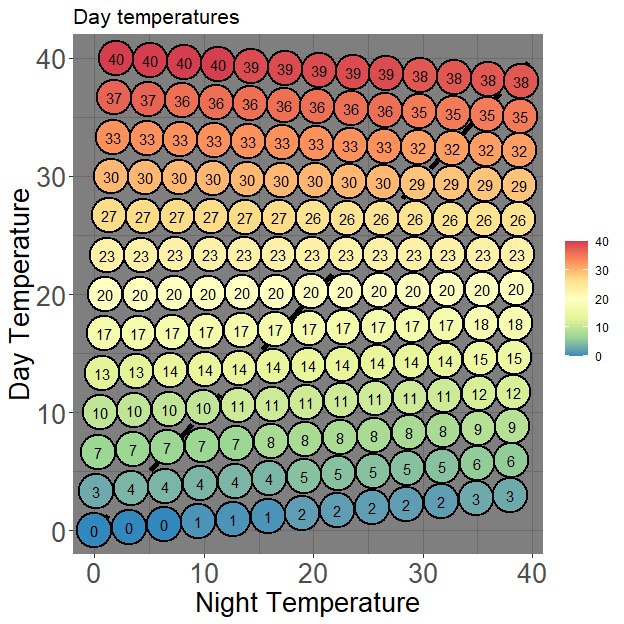

<!-- README.md is generated from README.Rmd. Please edit that file -->

# thermgRad

<!-- badges: start -->

[](https://github.com/pgomba/thermgRad/actions)

<!-- badges: end -->

## Tools to visualize and analyze germination in temperature gradient plates


`thermgRad` package aims to provide with tools to visualize and analyze
germination experiments conducted using a temperature gradient plate
(TGP) with a bidirectional setting (day/night cycle) and obtain cardinal
temperatures for each of the temperature fluctuations thresholds across
the thermal gradient plate.

## Installation

You can install the development version of thermgRad from
[GitHub](https://github.com/pgomba) with:

``` r
#install.packages("devtools")
#devtools::install_github("pgomba/thermgRad") 
library(thermgRad)
```

## What data does the package require?

-   Temperature: `thermgRad` needs average day and night corner
    temperatures. These are better recorded with an external temperature
    logger, since temperatures on the top side of the plate differ from
    those used in the TGP settings. If possible, It´s probably better to
    record temperatures in the center of four Petri dishes closest to
    the corner (either log the temperature before or after the
    experiment for a few days). But `thermgRad` provides the necessary
    tools to transform corner temperatures to corner Petri dish center
    temperatures.
    <center>
    
    </center>
-   Germination: `thermgRad` requires, for each Petri dish an ID,
    cumulative germination and day such germination was reached and
    total number of seeds in the Petri dish (germinated + moldy + viable
    after cut test) The data frame format containing all this
    information is a bit restrictive, but an example to how it should be
    formatted prior to load the data frame can be seen running the
    following code:

``` r
View(thermgRad::tg_example)
```

## Functions

### How is T<sub>50</sub> calculated?

T<sub>50</sub> values are obtained via `thermgRad::coolbear`, a function
adapting Coolbear et al. (1984) formula modified by Farooq et al.(2005).
<center>

</center>

where N represents the number of sowed seeds (germinated + viable +
moldy) from a single replicate in all the experiments and n<sub>i</sub>
and n<sub>j</sub> are the number of seeds germinated adjacently to (N/2)
at time t<sub>i</sub> and t<sub>j</sub> respectively. An example:

``` r
scoring_days<-c(seq(1,20,2))
cumulative_germination<-c(0,0,0,6,7,12,18,23,23,23)
total_seeds<-25

thermgRad::coolbear(scoring_days,cumulative_germination,total_seeds) #Outputs T50
#> [1] 11.16667
```

Among other things, `thermgRad::petri_grid` loops `thermgRad::coolbear`
all over the template data frame to obtain T<sub>50</sub> values for
each Petri dish

### Visualizing your experiment

`thermgRad::plot_results` collects your experiments results and
temperatures and collects them on a Day/Night graph. It´s possible to
choose between showing average Petri dish temperature, average
temperature fluctuation and germination with parameter
`toplot= "average`,`toplot= "fluctuation`or`toplot= "germina"`.

``` r
data<-thermgRad::tg_example
thermgRad::plot_results(data, 0,0,40,40,0,40,0,40, petri=13, toplot= "germina")
```


Input `?plot_results` in the R console for a list of parameters.
`0,0,40,40,0,40,0,40` refers to corner temperatures. The first four
number belong to daytime temperatures (Bottom left, Bottom right, Top
left and Top right) followed by nighttime temperatures (again, Bottom
left, Bottom right, Top left and Top right). `thermgRad:plot_results`
assumes you want to use average temperature between corners (e.g. If
during daytime the bottom left corner runs at 5°C, and the bottom right
corner runs at 8°C, the function will use 6.5°C). Enabling
`method="precise"` within the function creates a more accurate
temperature grid. The graph wont look as pretty, but analysis of
cardinal temperatures will be more accurate (which is the one that
matters).

``` r
data<-thermgRad::tg_example
thermgRad::plot_results(data, 0,3,40,38,0,38,2,39, petri=13, toplot= "fluctuation",method="precise")
```


If temperature was recorded in the corners of the TGP and need to be
adjusted to the center of each Petri use `"adjust==TRUE"`. Can be
combined with `"method==precise"`

``` r
data<-thermgRad::tg_example
thermgRad::plot_results(data, 0,3,40,38,0,38,2,39, petri=13, toplot= "average",method="precise",adjust=TRUE)
```



The dataset supporting this graph can be obtained by using
`thermgRad::grid_results`. Again, enabling `method="precise"` will
create a gradient using all corner temperatures instead of average
temperatures.

``` r
data<-thermgRad::tg_example
head(thermgRad::grid_results(data, 0,3,40,38,0,38,2,39, petri=13,method="precise",adjust=TRUE))
#>   PD_ID day_temp night_temp average  fluc abs_fluc     germ
#> 1    A1 40.00000   2.000000   21.00 38.00    38.00  0.00000
#> 2    A2 36.66667   1.833333   19.25 34.83    34.83 70.00000
#> 3    A3 33.33333   1.666667   17.50 31.67    31.67 75.00000
#> 4    A4 30.00000   1.500000   15.75 28.50    28.50 73.68421
#> 5    A5 26.66667   1.333333   14.00 25.33    25.33 80.00000
#> 6    A6 23.33333   1.166667   12.25 22.17    22.17 80.00000
```

### Obtaining cardinal temperatures

`thermgRad::cardinal` is the main function of package `thermgRad`. As
seen before, Petri dishes with similar fluctuation run in parallel to
the diagonal line crossing the TGP from left bottom corner to top bottom
corner. `thermgRad::cardinal` allows to isolate a range of temperature
fluctuation an obtain cardinal temperatures, sub and supra optimal
equations and a plot. Fluctuation thershold is inputted via `fs` (lower
threshold) and `fs` (upper threshold). In this example we obtain
cardinal temperature data for the diagonal, where the temperature
fluctuation is 0.

``` r
data<-thermgRad::tg_example
thermgRad::cardinal(data,0,0,40,40,0,40,0,40, petri=13,fs=0,fe=1)
```

This outputs a very simple graph representing your GR vs average
temperature:

 and table with the data in the graph with a
user prompt at the end asking the user to select which PD_ID is to be
used for both (sub- and supra-optimal)equations.


For this example we have selected number 7 (highest GR), obtaining the
following outputs:

``` r
# [1] "Suboptimal eq: y = 0.007x - 0.04, R.rsq = 0.963, p-value = 1e-04"
# [1] "Supraoptimal eq: y = -0.016x - 0.5, R.rsq = 0.957, p-value = 0.022"
# [1] "Tb = -6 3"
# [1] "Tc = 31 3"
# [1] "To = 20.12"
```


### Disclaimer

`thermgRad` is a hobby project. I only work on this during quiet times,
when I usually try to improve the code with newly acquired knowledge or
implement functions that could be useful to interpret the data. Please
feel free to suggest changes/improvements or raise any existing issues
via [github](https://github.com/pgomba/thermgRad).

### Roadmap

-   Include a method to adjust temperature from corner to Petri dish
    center ✔️
-   Create references section ❌ (March 22)
-   Include different methods to calculate cardinal temperatures ❌
-   Support replicates ❌
-   Shiny app
