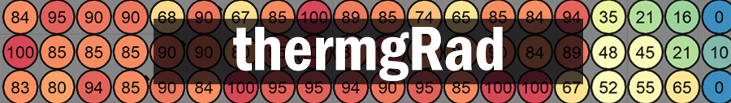
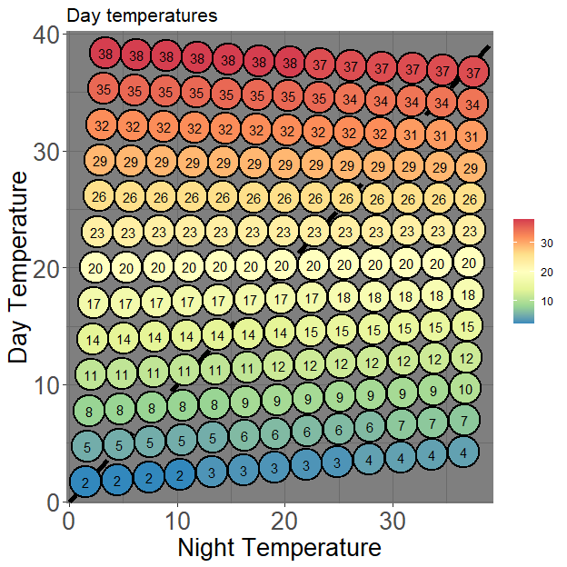

<!-- README.md is generated from README.Rmd. Please edit that file -->

# thermgRad

<!-- badges: start -->

[](https://github.com/pgomba/thermgRad/actions)

<!-- badges: end -->

## Tools to visualize and analyze germination in temperature gradient plates



`thermgRad` package aims to provide with useful tools to visualize and
analyze germination experiments conducted using a temperature gradient
plate (TGP) with a bidirectional setting (day/night cycle) and obtain
cardinal temperatures for each of the temperature fluctuations
thresholds across the thermal gradient plate.

## Installation

You can install the development version of `thermgRad` from
[GitHub](https://github.com/pgomba) with:

``` r
#install.packages("devtools")
#devtools::install_github("pgomba/thermgRad") 
library(thermgRad)
```

## What data does the package require?

-   Temperature: `thermgRad` needs average day and night corner
    temperatures. These are best recorded at the center of the nearest
    to each corner Petri dish (either log temperature for a few days
    before or after the experiment), but `thermgRad` provides with the
    neccesary tools to adjust temperature registered at each corner of
    the TGP to center of Petri dish temperature. Avoid using TGP setting
    temperatures as corner temperatures, since these can differ from the
    temperatures recorded on top of the metal plate.

-   Germination: `thermgRad` requires, for each Petri dish an ID,
    cumulative germination and day such germination was reached and
    total number of seeds in the Petri dish (germinated + moldy + viable
    after cut test) The data frame format containing all this
    information is a bit restrictive, but an example to how it should be
    formatted prior to load the data frame can be seen running the
    following code:

``` r
View(thermgRad::tg_example)
```

## Functions

### How is T<sub>50</sub> calculated?

T<sub>50</sub> values are obtained via `thermgRad::coolbear`, a function
adapting Coolbear et al. (1984) formula modified by Farooq et al.(2005).
<center>

</center>

where N represents the number of sowed seeds (germinated + viable +
moldy) from a single replicate in all the experiments and n<sub>i</sub>
and n<sub>j</sub> are the number of seeds germinated adjacently to (N/2)
at time t<sub>i</sub> and t<sub>j</sub> respectively. An example:

``` r
scoring_days<-c(seq(1,20,2))
cumulative_germination<-c(0,0,0,6,7,12,18,23,23,23)
total_seeds<-25

thermgRad::coolbear(scoring_days,cumulative_germination,total_seeds) #Outputs T50
#> [1] 11.16667
```

`thermgRad::coolbear` can be used as a standalone function or looped
through a data frame, which is what `thermgRad::petri_grid` does,
outputting individual information for each Petri dish (label, final
germination %, T<sub>50</sub> and germination rate).
`thermgRad::petri_grid` is one of the core sub-functions of
`thermgRad::cardinal`, but I’ll get to that later [(or jump to it
now!)](#obtaining-cardinal-temperatures).

``` r
data<-thermgRad::tg_example
head(petri_grid(data))
#>   PD_ID     germ       t50         GR
#> 1    A1  0.00000        NA         NA
#> 2    A2 70.00000 28.000000 0.03571429
#> 3    A3 75.00000 14.500000 0.06896552
#> 4    A4 73.68421 10.500000 0.09523810
#> 5    A5 80.00000  7.833333 0.12765957
#> 6    A6 80.00000  7.857143 0.12727273
```

### Visualizing your experiment

`thermgRad::plot_results` collects your experiments results and
temperatures and collects them on a Day/Night temperature graph. The
basic inputs this function needs are: - a formatted data frame like
`thermgRad::tg_example` - number of Petri dishes per column/row - Corner
temperatures following this order (Day Bottom Left, Day Bottom Right,
Day Top Left, Day Top Right, Night Bottom left, Night Bottom Right,
Night Top Left and Night Top Right) e.g:`0,0,40,40,0,40,0,40` - Desired
output via the parameter`toplot`, which allows to choose between several
options. Use `="daytemp"`,`="nighttemp"` or `="average"` to show day,
night or average temperature, respectively. Additionally, use
`="fluctuation"` to show the temperature fluctuation of each dish or
`="germina"` to show final germination %.

``` r
data<-thermgRad::tg_example
thermgRad::plot_results(data, 0,0,40,40,0,40,0,40, petri=13, toplot= "germina")
```


By default, `thermgRad:plot_results` uses average temperature between
“equal” temperature corners (i.e. If the bottom left corner is at 0°C
and the bottom right corner is at 2°C, it will assume the whole bottom
row is at 1°C). However, using `method="precise"` will create a
temperature gradient based in individual corner temperatures and will
likely give each Petri dish an individual temperature. The output plot
does not look as straight and good as one without using the method
(remember the grid is not a visual representation of the TGP, but a day
vs night temperature plot) but the temperature grid will be more
accurate

``` r
data<-thermgRad::tg_example
thermgRad::plot_results(data, 0,3,40,38,0,38,2,39, petri=13, toplot= "daytemp",method="precise")
```


There is yet another possible adjustment to do. If temperatures were
recorded in each of the TGP corners, this can be adjusted to the center
of each Petri dish for more accurate analysis. By adding the parameter
`adjust=TRUE`
<center>

</center>

``` r
data<-thermgRad::tg_example
thermgRad::plot_results(data, 0,3,40,38,0,38,2,39, petri=13, toplot= "daytemp",method="precise",adjust=TRUE)
```



To obtain the dataset used to create the graph use the function
`thermgRad::grid_results` which uses the same parameters from
`thermgRad::plot_results` without`toplot`.

``` r
data<-thermgRad::tg_example
head(thermgRad::grid_results(data, 0,3,40,38,0,38,2,39, petri=13,method="precise",adjust=TRUE))
#>   PD_ID day_temp night_temp  average  fluc abs_fluc     germ
#> 1    A1 38.38462   3.346154 20.86538 35.04    35.04  0.00000
#> 2    A2 35.32372   3.195513 19.25962 32.13    32.13 70.00000
#> 3    A3 32.26282   3.044872 17.65385 29.22    29.22 75.00000
#> 4    A4 29.20192   2.894231 16.04808 26.31    26.31 73.68421
#> 5    A5 26.14103   2.743590 14.44231 23.40    23.40 80.00000
#> 6    A6 23.08013   2.592949 12.83654 20.49    20.49 80.00000
```

### Obtaining cardinal temperatures

`thermgRad::cardinal` is the main function of package `thermgRad`. As
seen before, Petri dishes with similar fluctuation run in parallel to
the diagonal line crossing the TGP from left bottom corner to top bottom
corner. `thermgRad::cardinal` allows to isolate a range of temperature
fluctuation an obtain cardinal temperatures, sub and supra optimal
equations and a plot. Fluctuation thershold is inputted via `fs` (lower
threshold) and `fs` (upper threshold). In this example we obtain
cardinal temperature data for the diagonal, where the temperature
fluctuation is 0.

``` r
data<-thermgRad::tg_example
thermgRad::cardinal(data,0,0,40,40,0,40,0,40, petri=13,fs=0,fe=1)
```

This outputs a very simple graph representing your GR vs average
temperature:

 and table with the data in the graph with a
user prompt at the end asking the user to select which PD_ID is to be
used for both (sub- and supra-optimal)equations.


For this example we have selected number 7 (highest GR), obtaining the
following outputs:

``` r
# [1] "Suboptimal eq: y = 0.007x - 0.04, R.rsq = 0.963, p-value = 1e-04"
# [1] "Supraoptimal eq: y = -0.016x - 0.5, R.rsq = 0.957, p-value = 0.022"
# [1] "Tb = -6 3"
# [1] "Tc = 31 3"
# [1] "To = 20.12"
```


### Disclaimer

`thermgRad` is a hobby project. I only work on this during quiet times,
when I usually try to improve the code with newly acquired knowledge or
implement functions that could be useful to interpret the data. Please
feel free to suggest changes/improvements or raise any existing issues
via [github](https://github.com/pgomba/thermgRad).

### Roadmap

-   Include a method to adjust temperature from corner to Petri dish
    center ✔️ (March 22)
-   Create references section ❌
-   Include different methods to calculate cardinal temperatures ❌
-   Support replicates ❌
-   Shiny app
